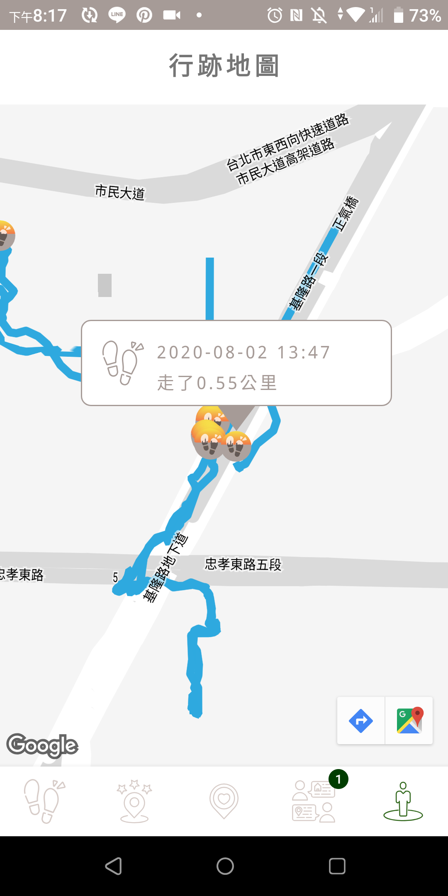

# Walkable City

Walkable City aims to make our city become pedestrian friendly and low carbon.
It encourages citizens to walk more frequently by offering interesting and cozy walk routes,
walk recordings and create event with friends!

## Flows

### Walker Flow

- Overview:  
Walker flow is designed base on walking behaviors from start to end, which includes:

- Prepare for a Walk:  
User can decide whether he/she wants to load a route and have a walk, choose a destination to walk to, or simply start a walk directly.

   

- Load a Route:  
User can load a route for walk reference from route collections of users favorites, routes nearby and user's walk history by filtering with minutes requested, destination, or sorting with 6 different street characteristics or features, including Tranquility, Scenery, Rest, Snacks, Coverage and Vibe.

  From Destination

   

  Load A route

   

- Walk recordings:  
While walking, walkable city would record each walk's duration and distance, and user can pause and resume whenever he/she wants, even leave the app and come back later with a single click. Along the walk, user can also take photos, which would be shown on the map in a split second.

  Distance and duration

   

  Photo taking

   

- Rating and Comments:  
When user finished a walk, he/she can share his walk by create a new route on the platform. User can also add rating and comments for the route reference.

    

- Dark Mode:  
Designed for user to walk at night.

  

### Route Flow

- Overview:  
Route flow is designed for user to find his/her route preference, load it on map, and start walking as easy as possible, which includes:

- Ranking and Fovarites collections:  
User can browse through all routes by time filter and feature sorting, and add to his/her own favorite collection.

- Route details:  
Displaying photo gallery, basic informations, average rating, and comments for a route. User can load to map from this page directly.

  &nbsp;&nbsp; 

### Event Flow

- Overview:  
Event Flow is designed for users to interact with each other, and encourages each other to walk more frequently as a community.

  

- Event details:  
Displaying members' accomplishment indicated by event type, including collaboration, competition or habit cultivation

   &nbsp;&nbsp; &nbsp;&nbsp;

- Create an event:  
User can create an event by his/her own, invites friends and sets event to be public.

  

### Recording Flow

- Overview:  
As each walk is recorded, recording flow is designed to encourages user to walk more by visualized what he/she has accomplished.

- Explorer map:  
User can see each walk path on a map clearly

  

- Badges:  
User would get a shareable image when he/she accomplished certain amount of walk total distance, walk total hours, events joined, or friends.

   &nbsp;&nbsp; 

- Ranking between friends:  
Once users are friends, they can keep track of friends' weekly, monthly or total walk distance.

  

## Framework & Tools

- Android
  - Kotlin
  - Activity & Service
  - MVVM
  - Coroutines
  - Unit Test

- JetPack
  - Lifecycle
  - Navigation
  - WorkManager
  - Data binding

- Networking
  - Google Map & Location API
  - Open Weather API
  - Firebase & Firestore
  - Retrofit2 & Moshi
  - Glide

- Tools
  - Git & GitHub

## IDE

**Android Studio** - 3.6.2

**Android SDK** - 23+

**Gradle** - 3.6.2

## Latest Version

1.1.3

## Contact

James walkablecity@gmail.com
